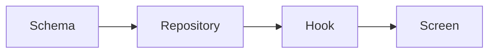

# Hedgehog PWA App Core ⭐

### Offline-First Apps That Don't Need a Backend

A tracker, a journal, a planner, a small team's board. Plenty of apps
like these run fine with no server at all. They need data that's
yours, that keeps working offline, and that syncs when you're back
online.

This core builds installable, offline-capable apps, structured to grow
without turning into spaghetti.



## What you get

- **Next.js + Dexie**, local-first by default. Your data lives on the
  device instead of behind a round trip.
- **Optional sync and auth via Dexie Cloud** for a shared list, a
  family calendar, or a small team, without giving up local-first
  reads and writes.
- **A commit gate** (lefthook + commitlint + ESLint guardrails) that
  keeps every layer honest before it lands.

## Built for personal and small-team apps

Reach for this core when the data fits on a device and belongs to the
person using it, even with sharing, accounts, or a point balance that
needs a server-authoritative record. A full backend earns its place
when server-side logic runs through the bulk of the app: background
jobs, webhooks, authorization beyond row-level rules.

## Easy to install and use

Ask your agent:
*"Install Hedgehog and build me a [your app idea]"*

<details>
<summary>For your agent</summary>

```
npx @skyf0xx/hedgehog init
```

Hedgehog's planner selects this core automatically when your project's
data fits on a device and belongs to the person using it. You can also
request it directly:

```
npx @skyf0xx/hedgehog init --pwa-app
```

Technical details: [ARCHITECTURE.md](ARCHITECTURE.md)
